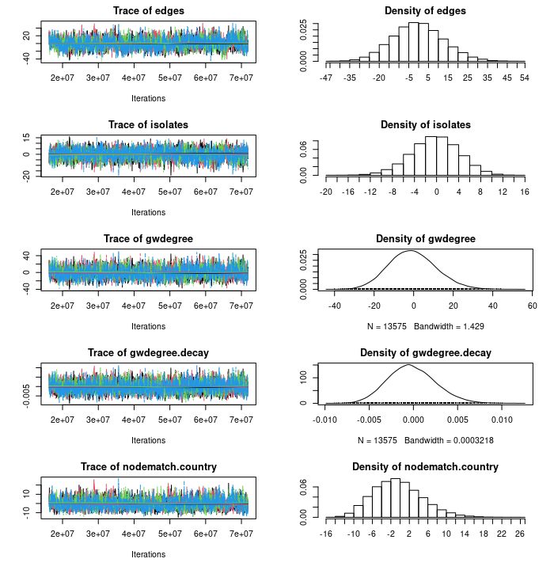
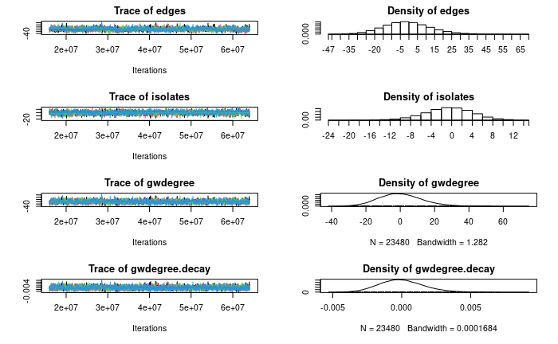
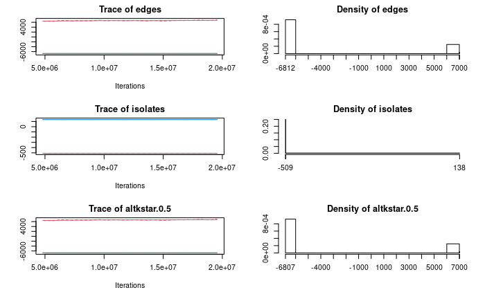

```{r setup, include = FALSE}
library("dplyr")
library("papaja")
r_refs("r-references.bib")
```

```{r analysis-preferences, include = FALSE}
# Seed for random number generation
set.seed(42)
knitr::opts_chunk$set(cache.extra = knitr::rand_seed)
```

```{r utility-functions, cache=TRUE, echo=FALSE}
# Common abbreviations:
# w: weighted
# uw: unweighted
# soc: sociological bill
# ind: industrial bill
# clim: climate
# nw: network object

# Function to add color attribute for parties in visualisations
add_party_colors <- function(net) {
  igraph::V(net)$color <- "gray"
  igraph::V(net)$color <- ifelse(igraph::V(net)$party== "EPP", "blue", igraph::V(net)$color)
  igraph::V(net)$color <- ifelse(igraph::V(net)$party== "IDG", "blue4", igraph::V(net)$color)
  igraph::V(net)$color <- ifelse(igraph::V(net)$party== "S&D", "red", igraph::V(net)$color)
  igraph::V(net)$color <- ifelse(igraph::V(net)$party== "ECR", "dodgerblue3", igraph::V(net)$color)
  igraph::V(net)$color <- ifelse(igraph::V(net)$party== "REG", "yellow", igraph::V(net)$color)
  igraph::V(net)$color <- ifelse(igraph::V(net)$party== "Greens/EFA", "green", igraph::V(net)$color)
  igraph::V(net)$color <- ifelse(igraph::V(net)$party== "The Left", "red4", igraph::V(net)$color)
  igraph::V(net)$color <- ifelse(igraph::V(net)$party== "NI", "slategray4", igraph::V(net)$color)

  return(net)
}

# Function to create table with network statistics
tab_statistic <- function(net, caption) {
  cn <- c("Measurement", "Value")
  num_nodes <- c("Number of nodes",igraph::vcount(net))
  num_edges <- c("Number of edges",igraph::ecount(net))
  trans <- c("Transitivity", sprintf(igraph::transitivity(net), fmt = "%#.3f"))
  dens <- c("Graph density", sprintf(igraph::edge_density(net), fmt = "%#.3f"))
  avg_path <- c("Average path length", sprintf(igraph::mean_distance(net), fmt = "%#.3f"))
  diam <- c("Diameter", igraph::diameter(net))
  
  tab <- rbind(cn, num_nodes, num_edges, trans, dens, avg_path, diam)
  rownames(tab) <- NULL
  
  return(tab)
}

# Function to create plot of network statistic
plot_statistic <- function(fun, edges, num_votes, xlab, ylab, title) {
  df <- data.frame(agreement = integer(), statistic = double())
  
  for (i in 0:num_votes) {
    edges_filter <- edges[edges[, "agreement"] > i, c("mep1", "mep2")]
    net_filter <- igraph::graph_from_data_frame(edges_filter, vertices = mep, directed = FALSE)
    stat_filter <- fun(net_filter)
    
    de <- list(agreement = i, statistic = stat_filter)
    df = rbind(df, de, stringsAsFactors = FALSE) 
  }
  
  plot(df, type = "l", col = "blue", xlab = xlab, ylab = ylab, main = title)
}

# Create plot of network with threshold value
plot_network_agreement <- function(edges, threshold, layout) {
  edges <- edges[edges[, "agreement"] >= threshold, c("mep1", "mep2")]
  
  # Create network
  net <- igraph::graph_from_data_frame(edges, vertices = mep, directed = FALSE)
  
  # Plot network
  net_isolates <- which(igraph::degree(net) == 0)
  # Remove isolates so that visualisation is clearer
  net_visualization <- igraph::delete.vertices(net, net_isolates)
  net_visualization <- add_party_colors(net_visualization)
  
  plot(net_visualization,
       vertex.size = 4,
       edge.size = .4,
       vertex.label = NA,
       layout = layout,
       main = paste("Threshold:", threshold, sep=" "))
}

# Create plot with threshold percentage
plot_network_agreement_percent <- function(edges, percent_threshold, layout) {
  edges <- edges[edges[, "agreement_percent"] >= percent_threshold, c("mep1", "mep2")]
  
  # Create network
  net <- igraph::graph_from_data_frame(edges, vertices = mep, directed = FALSE)
  
  # Plot network
  net_isolates <- which(igraph::degree(net) == 0)
  net_visualization <- igraph::delete.vertices(net, net_isolates)
  net_visualization <- add_party_colors(net_visualization)
  
  plot(net_visualization,
       vertex.size = 4,
       edge.size = .4,
       vertex.label = NA,
       layout = layout,
       main = paste("Threshold:", percent_threshold, sep=" "))
}
```

```{r import-data, cache=TRUE, echo=FALSE}
# Load data
mep <- read.csv("../../data/MEP_data.csv", header = T, sep = ",")
edges_soc_clim <- read.csv("../../data/edges_for_against_social.csv", header = T, sep = ",")
edges_ind_clim <- read.csv("../../data/edges_for_against_industry.csv", header = T, sep = ",")

# Saving vote data for statistics
ind_clim_votes <- select(mep,4:19)
soc_clim_votes <- select(mep,20:63)

# Rename columns
colnames(mep) <- c("mep", "party", "country")
colnames(edges_soc_clim) <- c("mep1", "mep2", "agreement")
colnames(edges_ind_clim) <- c("mep1", "mep2", "agreement")

# Drop unneeded columns for this analysis
mep <- mep[c("mep", "party", "country")]

# Create column for percentage of agreement
edges_soc_clim$agreement_percent <- round(edges_soc_clim$agreement / 44, digits = 2)
edges_ind_clim$agreement_percent <- round(edges_ind_clim$agreement / 16, digits = 2)
```

```{r create-igraph-networks, cache=TRUE, dependson="import-data", echo=FALSE, warning=FALSE}
# Create weighted networks
w_edges_soc_clim <- edges_soc_clim[edges_soc_clim[, "agreement"] >= 1, c("mep1", "mep2")]
w_net_soc_clim <- igraph::graph_from_data_frame(w_edges_soc_clim, vertices = mep, directed = FALSE)
w_net_soc_clim  <- igraph::set_edge_attr(w_net_soc_clim , "weight", value = edges_soc_clim$agreement_percent)

w_edges_ind_clim <- edges_ind_clim[edges_ind_clim[, "agreement"] >= 1, c("mep1", "mep2")]
w_net_ind_clim <- igraph::graph_from_data_frame(w_edges_ind_clim, vertices = mep, directed = FALSE)
w_net_ind_clim  <- igraph::set_edge_attr(w_net_ind_clim , "weight", value = edges_ind_clim$agreement_percent)

u_edges_soc_clim <- edges_soc_clim[edges_soc_clim[, "agreement"] >= 1, c("mep1", "mep2")]
u_net_soc_clim <- igraph::graph_from_data_frame(w_edges_soc_clim, vertices = mep, directed = FALSE)

u_edges_ind_clim <- edges_ind_clim[edges_ind_clim[, "agreement"] >= 1, c("mep1", "mep2")]
u_net_ind_clim <- igraph::graph_from_data_frame(w_edges_ind_clim, vertices = mep, directed = FALSE)

# Create unweighted networks
uw_edges_soc_clim_35 <- edges_soc_clim[edges_soc_clim[, "agreement_percent"] >= 0.35, c("mep1", "mep2")]
uw_net_soc_clim_35 <- igraph::graph_from_data_frame(uw_edges_soc_clim_35, vertices = mep, directed = FALSE)

uw_edges_ind_clim_35 <- edges_ind_clim[edges_ind_clim[, "agreement_percent"] >= 0.35, c("mep1", "mep2")]
uw_net_ind_clim_35 <- igraph::graph_from_data_frame(uw_edges_ind_clim_35, vertices = mep, directed = FALSE)

uw_edges_soc_clim_95 <- edges_soc_clim[edges_soc_clim[, "agreement_percent"] >= 0.95, c("mep1", "mep2")]
uw_net_soc_clim_95 <- igraph::graph_from_data_frame(uw_edges_soc_clim_95, vertices = mep, directed = FALSE)

uw_edges_ind_clim_95 <- edges_ind_clim[edges_ind_clim[, "agreement_percent"] >= 0.95, c("mep1", "mep2")]
uw_net_ind_clim_95 <- igraph::graph_from_data_frame(uw_edges_ind_clim_95, vertices = mep, directed = FALSE)

uw_edges_soc_clim_100 <- edges_soc_clim[edges_soc_clim[, "agreement_percent"] >= 1.0, c("mep1", "mep2")]
uw_net_soc_clim_100 <- igraph::graph_from_data_frame(uw_edges_soc_clim_100, vertices = mep, directed = FALSE)

uw_edges_ind_clim_100 <- edges_ind_clim[edges_ind_clim[, "agreement_percent"] >= 1.0, c("mep1", "mep2")]
uw_net_ind_clim_100 <- igraph::graph_from_data_frame(uw_edges_ind_clim_100, vertices = mep, directed = FALSE)
```

```{r create-network-networks, cache=TRUE, dependson="create-igraph-networks", echo=FALSE}
# Convert weighted networks
w_net_soc_clim_nw <- intergraph::asNetwork(w_net_soc_clim)
w_net_ind_clim_nw <- intergraph::asNetwork(w_net_ind_clim)

# Convert unweighted networks
uw_net_soc_clim_35_nw <- intergraph::asNetwork(uw_net_soc_clim_35)
uw_net_ind_clim_35_nw <- intergraph::asNetwork(uw_net_ind_clim_35)
uw_net_soc_clim_95_nw <- intergraph::asNetwork(uw_net_soc_clim_95)
uw_net_ind_clim_95_nw <- intergraph::asNetwork(uw_net_ind_clim_95)
uw_net_soc_clim_100_nw <- intergraph::asNetwork(uw_net_soc_clim_100)
uw_net_ind_clim_100_nw <- intergraph::asNetwork(uw_net_ind_clim_100)
```

\newpage

## Executive Summary
<!--
Executive Summary Description (150 words) – 0.3 POINTS

Basically an Abstract.

Summarize the report. Write this as the very last thing.

What is the main topic you are addressing?

What are your research questions and hypotheses?  

What are your results and the main conclusion?
-->

This study investigated the cohesion of agreement when voting among members of the European Parliament (MEPs) on the national level. This was done by examining agreement related to a selected sociologically related climate bill voted on by the Ninth European Parliament. Firstly, QAP was used to find the correlation in voting behaviour of MEPs with regards to the sociological climate bill and a selected industrial climate bill. It was expected that the correlation would be high if voting behaviour is consistent and not just isolated to one bill which was confirmed with a high statistical significance. Secondly, an ERGM model was used to investigate the influence of nationality on MEPs voting behaviour agreement in the sociological climate bill. Combining findings from different studies, it was expected that there would be a high level of cohesion between MEPs of the same nationality. This was confirmed with a statistically significant result that MEPs being from the same country determined them completely agreeing with each other for this bill. 

\newpage

# 1. Introduction 
<!--
Introduction Description (about 1000 words) – 0.5 POINTS

Place your topic of choice within the existing literature and explain what you 
are going to address in this report and why.

*	What is the main topic that is going to be studied in this paper?

*	Why is it important?

*	What are the existing studies that address it already?

*	What are your questions and hypotheses? Why are they important? How are they 
connected to previous work or to a problem you raised?

*	Which methods are you using? Why?

*	How is your work going to contribute to the field/or to whom (e.g., industry)?

*	What does the rest of the report look like? In one short paragraph, list the 
topics of the following sections.
-->

## 1.1 Topic of choice and literature review

The European Parliament (EP) is composed of 705 members (MEPs). Each member is elected to represent the European population as a whole, but they are often also a member of a national party of one of the European Union (EU) member states. The officials from these national parties then form European groups in the EP based on the ideology of their national parties [@political_parties].

An interesting political clash to investigate therefore is between ideology and national interest. European groups are formed based on a common ideology, yet all members also have to take national interest into account. As a result, it is interesting to investigate for certain motions. An example of such a bill during the Ninth European Parliament (2019-2024)  was "The impacts of climate change on vulnerable populations in developing countries" [@impacts_of_climate_change_2021]. This bill called for recognition of the unfair impact of climate change on developing countries and set out potential steps that could be taken in response. Mónica Silvana González, an MEP and member of the European Parliament's Development Committee argued, in response to this bill, that the European Parliament had to 'unite to face the greatest threat in the history of humankind' [@silvana_gonzalez_2021].

There has already been a significant amount of research carried out looking at cohesion on the party level, see @cherepnalkoski_karpf_mozetic_grcar_2016, @current_future_dynamics, @cicchi_2017. Here cohesion is defined in line with the definition provided by @cherepnalkoski_karpf_mozetic_grcar_2016 who view cohesion as the propensity to vote in the same manner within the same group, here the same European parliamentary group or country. This research closes a research gap by focusing on political cohesion on a national-level interest instead of party-level interest during the voting regarding the "The impacts of climate change on vulnerable populations in developing countries" bill, henceforth referred to as the sociologically focused climate bill due to its focus on the human impact. Through this, the research will aim to distinguish if national interests influence voting of MEPs using networks of voting agreement.

While this research focuses on the national dynamics of this one bill, it is desirable that the results could suggest future interesting avenues of research by seeing how similar the voting dynamics in this area are with others. Therefore it is first evaluated whether the voting behaviour with regard to this more sociologically focused bill is consistent with results from another industrially focused climate-related bill using the following research question:

_RQ1: “What is the correlation between the voting agreement networks from the sociologically focused climate bill and the chosen industrial climate bill?”_

The industrial bill chosen from this purpose was the "Research Fund for Coal and Steel" bill [@coal_and_steel_2021], henceforth referred to as the industrially focused climate bill. The votes for this bill were carried out by MEPs on the same day as the chosen sociologically focused bill. It can therefore be expected that similar dynamics are in place in terms of the current political climate, the current composition of the parliament, absences of certain MEPs and other time-sensitive circumstances. This bill was regarding funding for the development of cleaner steel production and the move away from coal. 

Previous research on parliaments has shown that political parties are highly decisive in influencing MEPs voting behaviour [@Muller2000]. The parties unite MEPs, organise the agenda and determine the procedure of the parliament [@Kopecky1996]. This research suggests that European groups heavily influence the voting behaviour of the individual MEPs. Furthermore, in accordance with the focus of this research, we expect there to be an impact from the national interests of an MEP. There may be differences in how these interests interact depending on the situation of the political party or country at the time [@current_future_dynamics]. However, both votes are climate centred and carried out in similar circumstances so it is expected that the MEPs vote similarly over both votes. Using this logic, the following hypothesis is formulated:

_H1: “We expect a high level of correlation.”_

Secondly this paper will proceed with the focus of this research: looking at the national level effect on voting cohesion for the sociologically focused bill. Although the purpose of the European groups is to have unity in the voting behavior of its members, it can be the case that the interests from certain national parties clash with those from the European group. For instance, the European Christen Democrats group (EPP) has been in dispute with Hungary's Fidesz party, eventually leading to Fidesz leaving the group [@de_la_baume_orbans_2021].

Therefore, given these potential clashes between national and European interests, and the call for unity made by an MEP with regards to this bill, we are interested in investigating the unity of MEPs within European countries for the sociological climate bill. As such, we have formulated the following research question:

_RQ2: “What is the cohesion of agreement, based on the voting agreement network of the sociological climate bill, for MEPs with the same nationality?”_

As stated before, the European groups are expected to strongly influence the voting behaviour of the individual members of the European Parliament. However, other research highlights that MEPs maintain a national orientation, which can be linked to the distributive theory, which states that re-election is the main goal of legislators [@Scully2005, @Weingast_and_Marschall1988]. This suggests that MEPs not only vote according to the European group interest, but also according to the national party interest in order to maintain popularity with their electorate. Following this reasoning and the previously mentioned call for unity, the following hypothesis is formulated:

\newpage

_H2: “We expect a high level of cohesion on the national level.”_

Our work will contribute to the field by providing additional insight into the voting behaviors of given MEPs, specifically on the national level, in contrast to the previous focus on the party-level. Furthermore, the recent nature of these votes during 2021 in the Ninth European Parliament can suggest whether voting patterns have remained similar over time adding to earlier studies, see @Eveland2013; @Schneider2007; @Nicoll_Victor2017. 

The report proceeds as follows: firstly the methodology is explained concerning the obtention of the data, along with exploratory results of the data in the form of plots. Subsequently, the first hypothesis will be considered by comparing correlation between the two chosen bills using a QAP test. Following this, the research will focus on the sociologically based bill, looking at the national level effect on voting agreement using an ERGM model. Lastly, the results of the paper will be summarised in the form of the conclusion.

\newpage

# 2. Methodology

## 2.1 Dataset 
<!-- 
Dataset Description (about 500 words) 1 POINT (+ BONUS)

*	Which data set are you going to use? Three options:

  *	Use readily/easily available data (0 bonus points)

  *	Combine two or more existing datasets (max 0.5 bonus points)

  *	Scrape or collect your own data (max. 1 bonus point)

*	Clearly explain where the data is coming from:

  *	Who collected the data?

  *	What is the source?

  *	When was the data produced?

  *	How was the data collected?

*	Provide descriptive measures of your data (tables, plots, etc.)


*	Why is this data useful to study your topic and answer your research questions?

*	What is the potential bias in the data? How does this affect your results?
-->

### 2.1.1 Source of data and collection

The analysis conducted in this paper is carried out over a set of 61 roll-call votes from two motions for European Parliament resolutions. Roll-call votes are votes conducted in the European parliament where the vote (or absence of vote in some cases) of an MEP is recorded along with their name [@cherepnalkoski_karpf_mozetic_grcar_2016].

The results from these votes were scraped from the VoteWatch.eu website on 20th October 2021. VoteWatch is a non-profit organisation with the goal of providing insight into the European Parliament and their decision making [@noauthor_votewatchmethodology_nodate]. The code used to scrape the data can be found in the appendix see [A. Scraping code (VoteWatch)]. The sociologically focused bill has 45 roll-call votes while the more industrially focused bill has 16. The full official documents of the votes can be found in the appendix, see [H. Impacts of Climate Change Document] and [G. Coal & Steel Vote Document]. The appendix also contains some descriptive measures of the data, see [B. Data summary].

### 2.1.2 Creation of the networks

To conduct the analytical tests required for the research questions, networks had to be created. Using weighted edges equaling the number of times the two MEPs agreed on each vote in the bill was an option. A weighted network was suitable for the first research question using a QAP-test to look at correlation. However, for the second research question, a traditional ERGM model was used which can can only handle binary edges.

Therefore, in order to create a binary network of agreement between MEPs a decision was required to determine what conditions would create an edge between a pair of MEPs. Previous research has created networks from each individual roll-call vote where an edge equals agreement in that particular vote [@cherepnalkoski_karpf_mozetic_grcar_2016]. This required the creation of an ERGM model for each roll-call vote and then combining the results with a meta-analysis method. Given the time restrictions of this project, a decision was made to create an edge between individuals based on agreement in a certain number of votes or more following the approach adopted in previous papers, see @cranmer_desmarais_2011, and thus implementing a so called threshold. This threshold includes an edge between two MEPs if they have a minimum agreement equal or above the threshold. See [C.1 Threshold determination] for discussion of threshold determination and the selection of thresholds for both tests.

It also had to be defined what was classed as agreement in a vote between two MEPs. While it is clear that two MEPs are in agreement if they both vote for or both against a motion, this is less clear in the case of abstaining, being absent or just not voting. This could be due to disagreement with the motion, perhaps an unwillingness to go against your party but could also be due to a personal issue, logistical problem or lack of information. It is therefore not possible to say if these MEPs have the same opinion about the vote. An agreement was therefore only considered valid in this research if they both voted for or against. 

### 2.1.3 Network descriptive measures

In order to get a better overview of the dataset, the five-number summary was computed for both the sociological climate motion and the industrial climate networks The following two tables show these statistics for the two full networks where there is an edge between MEPs if they agree in at least one sub-vote. As this is an undirected graph only the number of nodes and edges is shown rather than the dyad-cencus as this would not provide any additional information.The networks are unimodal given MEPs link only to other MEPs.

The centrality chart for these networks was also examined but was difficult to interpret given number of nodes included. Additionally, the centrality chart pointed towards the low centrality of the graphs which is easy to confirm with the statistics below. Due to the high transitivity and density of the graph, there are not many specific nodes that are more/less central in the graphs.

The summary statistics of the graph already point to a high level of similarity in structure. They both have very high density and transitivity. They also have the same path length and diameter, likely due to the many connections between nodes in both graphs.

```{r, cache=TRUE, dependson=c("utility-functions", "create-igraph-networks"), echo=FALSE}
papaja::apa_table(tab_statistic(u_net_soc_clim), caption = "Statistics for full sociological climate network", placement = "H")
papaja::apa_table(tab_statistic(u_net_ind_clim), caption = "Statistics for full industrial climate network", placement = "H")
```

### 2.1.4 Usefulness of data for research questions and potential biases

The collected data concerns the names of MEPs, their nationality, European-level political party and vote for each relevant motion for resolution. This data provided enough information to be able to answer the research questions discussed above. The collection of data for the two bills also allowed the comparison of the chosen bill with another one to check consistency of voting behaviour.

A limitation of the data collected was the lack of information about the personal network dynamics at play in the European parliament. Agreement between individuals is likely also influenced by who they are friends with, who individuals tend to sit with and who they collaborate with most often. There are likely also more powerful members of the party such as national and European-party level leaders who may therefore invoke a higher level of agreement from others. With the data collected these dynamics are either impossible to model or can only be done in a limited manner.
For this research only one bill was chosen to focus on. This was done due to the importance placed on this bill by members of the European Parliament themselves but also due to time restrictions placed on this research. Previous research has examined all relevant motions in a particular period, see @cherepnalkoski_karpf_mozetic_grcar_2016. The research carried out in this paper is therefore considered to be a point-in-time comparison on a particular motion of importance which could trigger future investigation if this brief analysis indicates interesting results.
An issue with the collection method of the roll-call data is that it was collected via a third-party website VoteWatch rather than the European parliament website. This decision was taken due to the significant difference in ease in navigating and accessing the data on the two sites. The risk of this choice is considered to be small as the aim of VoteWatch is transparency so the data is likely to be accurate. However, it is not impossible that differences could have been caused when reproducing the vote results between the two websites. Given more time to conduct this research, a next step would be to build a method for finding the relevant votes in the European parliament minutes and scraping the data directly.

## 2.2 Research Rationale
<!--
Data Analysis (Research Rationale) (about 500 words) – 1 POINTS

*	Why are these two methods suitable for your data?

*	Why are these two methods suitable for your research questions?

*	Are there other methods to address these questions? If yes, why are the 
methods you chose better for this case?
-->

The first research question looks at the correlation between the network from the sociological climate bill and the network from the industrial climate bill. A QAP correlation test was determined to be the most appropriate method to use for this purpose. QAP is similar to CUG, in that it uses statistical simulation to generate a distribution of hypothetical networks. However, with QAP permutations of the networks themselves are compared, similar to the practice of bootstrapping, which maintains the networks' structural properties. A QAP correlation test is the most suitable option as it is suitable for comparing two or more networks. A QAP linear model could be used to see how voting on one bill 'explains' voting in the other but would be redundant here given the lack of other networks to be included and the requirement to only check association.

\newpage

The second research question investigates the cohesion of agreement, based on the voting behaviour for the sociological climate bill, for MEPs with the same nationality. Two MEPs are connected if they vote the same way. As the aim of this research is to determine the importance of similar nationality in agreement (an edge in the network) between two MEPs, an exponential random graph model (ERGM) is chosen. An ERGM is a class of network models for performing causal inference which can be used to determine the causes leading to an observed network. The model can include endogenous (qualities within the network) and exogenous (qualities external to it). Nationality is a vertex-level attribute and is therefore included as an exogenous term. All terms used will also need to be undirected terms due to the nature of the network. The complexity and flexibility of ERGM makes this technique very suitable for verifying the research question. ERGMs, unlike simpler methods such as logistic regression, allow us to model how structural properties of the network itself can affect the probability of an edge forming.

\newpage

# 3. Results
<!--
Results Description (about 2000 words)
-->
## 3.1 QAP test

In this section the correlation between the social climate vote network and the industrial climate vote network was analysed with QAP-tests to give an the answer to the first research question. A QAP test could be used here as both networks cover the same group of MEPs, therefore the linear subspace method can be used. Calculating the correlation therefore involved comparing the existence of an edge (and its weight if included) between two MEPs in the first network with the existence of an edge between the same two MEPs in the second network.

A QAP test involves permuting both networks multiple times and each time calculating the correlation of the two networks to create a distribution of correlations. This is then compared to the correlations of the original networks to see if the statistic that is calculated on the original graphs is extreme for a graph controlled by this size and structure. This likelihood of observing this statistic is reflected in the p-value returned. This therefore uses the original graph and creates a distribution based for comparison of what the association would be under the null hypothesis of there being no association. The product-moment correlation statistic is used here as the most common statistic for correlation in networks [@MEGHANATHAN2021339].

QAP tests were carried out on the full network, the 35% threshold network, the 95% threshold network and with the weighted networks for full coverage of the voting behaviour exhibited in the networks (see [C.1 Threshold determination]). For example, it is possible that there could be less correlation with lower thresholds due to random noise that could come from a chance agreement between two MEPs. In contrast, in the comparison of the two 95% networks we expect an extremely high level of correlation as the agreement is not then likely by chance. This is particularly true in this case as it can be expected that if an MEP has a strong opinion on what should be done regarding the human impact of climate change that they would also have strong opinions about what could be done in industry that might impact the climate. 

The resulting graphs from the QAP tests can be viewed below (see [D. Detailed QAP results] for the detailed output). It can be immediately seen that the correlation between both networks in all four tests is very significant. The correlation between the full networks (top left) (an edge between MEPs if they agree at least once) has a high correlation of 0.641 (p-value = 0.000). However, upon examination this is likely due to the very high number of edges in the initial network- if all MEPs agree with the other MEPs on at least one vote then the whole network will be connected. This is reflected in the high densities of these graphs (0.964 and 0.977) meaning that the probability is very high that there will be matching edges in both network. 

The results from the thresholded networks are then more interesting. There is a lower but still significant correlation of voting agreement in the 35% networks (top-right) of 0.346 (p-value= 0.000) and a slightly higher correlation with the 95% network (bottom-left) of 0.397 (p-value= 0.000). The decrease in correlation compared to the initial network is caused by comparing far sparser networks, there is less chance that two MEPs agree 35% or 95% of the time. However, the higher correlation in the 95% graph compared to the 35% graph is likely due to the high threshold set. While the 35% thresholded networks could still include pairs of MEPs who agreed with each other by chance 35% of the time this is extremely unlikely with the 95% network. These networks therefore focus on very specific voting agreement. An example of this voting agreement can be seen by examining the edges present in the 95% graphs as in both networks nearly all members of the Progressive Alliance of Socialists and Democrats party (S&D) completely agree with each other. This is an example of the behaviour that can cause the association in the networks noted here.

\newpage

Finally, the most complete result is perhaps the QAP results from the weighted networks (bottom-right). As opposed to the tests carried out on the binary networks this test also includes the information about the amount of agreement (measured as a percentage) between the two MEPs. Unlike the other QAP graphs, here there is an overlap between the result observed in the networks and the permuted graphs in the QAP test. However, the correlation between the two graphs is still highly significant with a correlation of 0.03 (p-value:0.004). While this correlation statistic is much lower than the previous values this is likely due to the introduction of weights and is an example of how the context of the networks involved needs to be included in the test in order to test the significance of the correlation statistic. This is the strength of the QAP test as it enable us to do this via permutations.

```{r results-qap, cache=TRUE, dependson="create-network-networks", echo=FALSE}
par(mfrow = c(2, 2), cex = 0.6)
mep_cor <- sna::qaptest(list(w_net_soc_clim_nw, w_net_ind_clim_nw),
                        FUN = sna::gcor,
                        g1 = 1,
                        g2 = 2,
                        mode = "graph",
                        reps = 1000)
sum_mep_cor <- summary(mep_cor)
sna::plot.qaptest(mep_cor, xlim = c(min(sum_mep_cor[[2]]) - 0.005, sum_mep_cor[[1]]))

mep_cor_35 <- sna::qaptest(list(uw_net_soc_clim_35_nw, uw_net_ind_clim_35_nw), 
                           FUN = sna::gcor,
                           g1 = 1,
                           g2 = 2,
                           mode = "graph",
                           reps = 1000)
sum_mep_cor_35 <- summary(mep_cor_35)
sna::plot.qaptest(mep_cor_35, xlim = c(min(sum_mep_cor_35[[2]]) - 0.005, sum_mep_cor_35[[1]]))

mep_cor_95 <- sna::qaptest(list(uw_net_soc_clim_95_nw, uw_net_ind_clim_95_nw), 
                           FUN = sna::gcor,
                           g1 = 1,
                           g2 = 2,
                           mode = "graph",
                           reps = 1000)
sum_mep_cor_95 <- summary(mep_cor_95)
sna::plot.qaptest(mep_cor_95, xlim = c(min(sum_mep_cor_95[[2]]) - 0.005, sum_mep_cor_95[[1]]))

s_m <- network::as.sociomatrix(w_net_soc_clim_nw, matrix.type="adjacency", attrname="weight")
i_m <- network::as.sociomatrix(w_net_ind_clim_nw, matrix.type="adjacency", attrname="weight")

mep_cor_w <- sna::qaptest(list(s_m, i_m), 
                          FUN = sna::gcor,
                          g1 = 1,
                          g2 = 2,
                          mode = "graph",
                          reps = 1000)
sum_mep_cor_w <- summary(mep_cor_w)
sna::plot.qaptest(mep_cor_w, xlim = c(min(sum_mep_cor_w[[2]]) - 0.005, sum_mep_cor_w[[1]]))
par(mfrow = c(1, 1))
```

From the results it can therefore be concluded that there is an association between how pairs of MEPs agreed in the sociological climate bill and the industrial climate bill for both weighted agreement, with thresholds for incidental agreement and almost total agreement. This therefore provides evidence in line with the first hypothesis of this paper, which states that there is high correlation between the sociological climate bill and the industrial climate bill.

## 3.2 ERGM

<!--
ERGM Description (about 1000) – 2.5 POINTS

* Present your results appropriately (plots, tables…) and discuss your findings 
in plain English

* Discuss the meaning of your findings in relation to your hypothesis. (half of 
the points evaluated in this other part)
-->

```{r import-ergm, cache=TRUE, echo=FALSE}
# Load models from cache
m0 <- readRDS("../../models/m0.rds")
m0_fit <- readRDS("../../models/m0_fit.rds")
m2_1 <- readRDS("../../models/m2_1.rds")
m2_1_fit <- readRDS("../../models/m2_1_fit.rds")
m2_2 <- readRDS("../../models/m2_2.rds")
m2_2_fit <- readRDS("../../models/m2_2_fit.rds")
m4 <- readRDS("../../models/m4.rds")
m4_fit <- readRDS("../../models/m4_fit.rds")
```

In this section the cohesion of agreement, based on the sociological climate bill, for MEPs with the same nationality was investigated using a total agreement network. This meant that there were only edges between MEPs if they completely agreed with each other. This was desirable in answering the research question as it focused the research on the network dynamics leading to complete cohesion (see [C.3 Percentage Threshold determination] for more detail and visualisations). The influence of MEP nationality on cohesion (edge formation in the network in this case) was measured using the exogenous term nodematch to check for homophily between nodes in terms of nationality.

ERGM models are part of the exponential random graph model family. ERGMs make use of Monte Carlo Maximum Likelihood estimation by generating a series of matrices representing the network, differing one edge at the time. The Metropolis-Hastings or Gibbs sampler algorithm is used to decide which edges to change. The new state that increases the likelihood of observing the network in question is then used for the next step. ERGMs are built sequentially meaning that after a new term is added to the model formula, the model will be carefully evaluated using the Goodness-of-Fit Metrics and the MCMC Diagnostics before proceeding.

Structural terms are a requirement for ERGM’s to properly fit the network. There are 176 different structural terms, each term captures a different type of relation or structure in the network. To properly pick structural terms the network in question needs to be analysed in detail. The first structural term analysed here was degree which immediately showed a remarkable feature of the graph: there are 567 vertices with degree 0 (isolates), see [E. Detailed ERGM analysis]. It can also be seen that there are 117 vertices with degree 116 indicating a very dense community within the network. Further inspection shows that the 117 vertices with degree 116 are all from the S&D party, indicating that at least in this area the party is very cohesive. The second structural term analysed is kstar, party leaders have been shown to affect cohesion in previous research so it is possible that more individuals will agree with party leaders [@bailer_schulz_selb_2009]. It can be observed  from the results that there are a large number of high-order stars present in the network, see [E. Detailed ERGM analysis].

A total of four models were fitted to answer the research question. The first model (m0) only contains an intercept: edges. This model converged but produced poor performance as indicated by the Goodness-of-Fit Metrics, see [F.1 Model 0 (m0)]. This was expected because the model does not contain any of the structural effects and is therefore only used as a baseline. The second model (m1) contains the intercept and a structural term to account for the large amount of isolates in the network: edges + isolates. This model crashed, throwing a degeneracy error. Model 2.1 (m2_1) and model 2.2 (m2_2) built upon this model including gwdegree or altkstars as structural terms. The curved variants of these two terms are used since the network that is being investigated is too large to use regular terms. Model 2.1 converged and showed good Goodness-of-Fit Metrics and MCMC Diagnostics, see [F.3 Model 2.1 (m2_1)]. Model 2.2 failed to converge within the set iteration limit (60) and was therefore discarded. 

Model 3 (m3) tested if party membership had a positive effect on agreement by also including nodematch(“party”). The intention of this model was to see if the results matched with previous research carried out in this area. However this model failed to converge within the time limit set by the group. The final model 4 (m4) tested the second research question: What is the cohesion of agreement, based on the sociological climate bill, for MEPs with the same nationality? The model converged showing promising results in the output as well as the Goodness-of-Fit plots and MCMC Diagnostics. The AIC and BIC of model 4 is in fact greater than those for model 2.1 but nodematch(“country”) was the focus of the research so this model was still suitable.

```{r results-ergm, cache=TRUE, dependson="import-ergm", echo=FALSE, results="asis"}
texreg::texreg(list(m0, m2_1, m2_2, m4),
                caption = "Models",
                custom.model.names = c("Model 0 (m0)", "Model 2.1 (m2\\_1)", "Model 2.2 (m2\\_2)", "Model 4 (m4)"),
                custom.gof.rows = list(GOF = c("FAIL", "PASS", "PASS", "PASS"),
                                       MCMC = c("-", "PASS", "FAIL", "PASS")))
```

\newpage

By analysing the Goodness-of-Fit plots it can be observed that the model has a decent fit. The line mostly goes through all the blue points and stays within the boundaries. The statistics show some strange behaviour which can be attributed to the previously noted properties of the graph. There are no vertices between degree5 and degree116, which is highlighted by the flat line in the plot between these two values. Before degree5 and after degree116 the line moves between the error boundaries showing an acceptable result. The MCMC Diagnostics for model 4 are also sufficient, the chains are mixing well for all model terms and the distributions are nicely centred around zero.
Therefore proceeding with analysing the actual results from the model it can be observed that nodematch(“country”) is statistically significant. By interpreting the coefficient the conclusion can be drawn that complete agreement is more likely between MEPs from the same country. There was an 84% probability that two MEP’s coming from the same country predicts them completely agreeing while voting on the "The impacts of climate change on vulnerable populations in developing countries" bill. This is evidence supporting the second hypothesis of this research, which states that there is a high level of cohesion on the national level within the voting agreement network of the sociological climate bill.

```{r, cache=TRUE, dependson="import-ergm", echo=FALSE}
papaja::apa_table(SNA4DS::Ef_int(m4, type = "prob"), caption = "Model 4 (m4)", placement = "H")

par(mfrow = c(2, 2))
plot(m4_fit)
par(mfrow = c(1, 1))


```

\newpage

# 4. Conclusion
<!--
Conclusion Description (about 350 words) – 0.7 POINTS

What were your topic and research questions again? (1 sentence)

What did you learn from the two analysis you run? *** most important point to 
address 0.5 POINTS here

Who benefits from your findings?

What does remain an open problem?

Can you give suggestions for future work in this area?
-->

The topic of the research is to describe the level of cohesion among 705 members of the European parliament according to their national affiliation with regards to a specific sociologically focused climate bill. The first research question was answered with the QAP results, showing that the voting behaviour in the sociologically focused climate bill is significantly similar to a different industry focused climate bill. This was shown with the consistently statistically significant correlation result. 
Consequently, the ERGM was run on the sociological climate bill only due to the identified importance of unity within the bill. The latter analysis revealed an 84% probability that MEPs being from the same country determines them vote exactly the same in the bill. Further research could look at unity within specific countries by using nodematch(diff=TRUE) while completing the ERGM modelling. This may require working with smaller networks due to the tendency for degeneracy of the model used here caused by its size.

While this research shed some light on voting dynamics there are still tendencies that could not be modelled in this research due to lack of data. For example, social interactions between MEPs and how MEPs handle conflicts between their political party and national interests. It is possible in this case that MEPs could abstain or make themselves absent which would not be revealed in our chosen model. This issue could be fixed at least partially with the collection of more data, for example, tweets between MEPs could be scraped as an indicator of social interaction. This could lead to more interesting analyses. The created ERGM here could also be extended to include other characteristics such as political party cohesion for more insight. Furthermore, this research was completed on one bill which was identified due to the stressed importance of unity. Unity across other important bills could be examined to generate more insights and see if cohesion on the national-level is consistent outside of climate related votes.

Nevertheless, the results from this research are invaluable for climate campaigners, political journalists as well as officials within the European Parliament who may wish to better understand the dynamics at play when voting. This result is also significant for the ordinary European citizen: higher cohesion on the national level suggests that the national priorities are significant in determining how an MEP votes. Citizens can therefore be sure that it is not only European party politics but also the current situation within their own country that will determine how their MEPs vote.

\newpage

# References

\begingroup
\setlength{\parindent}{-0.5in}
\setlength{\leftskip}{0.5in}

<div id="refs" custom-style="Bibliography"></div>
\endgroup

\newpage

# Appendix

## A. Scraping code (VoteWatch)

```python
from urllib.request import Request, urlopen

import pandas as pd

def scrapeWebsite(url):
    #Website to be requested
    req = Request(url, headers={'User-Agent': 'Mozilla/5.0'})
    xhtml = urlopen(req).read()

    string = xhtml.decode('utf-8')
    title = string.split('<div class="div_tabled_info_full">')[1].split('<')[0]
    new_url = string.split('var source_individual_votes = "')[1].split('"')[0]

    req = Request(new_url, headers={'User-Agent': 'Mozilla/5.0'})
    xhtml = urlopen(req).read()

    df = pd.read_json(xhtml, orient='records')

    df['MEP'] = df['all_votes'].astype(str).str.split("mep_name_link': 'https://www.votewatch.eu/en/term9-").str[1].str.split(".html").str[0].str.replace("-", " ").str.title()
    df['group_abbv'] = df['all_votes'].astype(str).str.split("grup': '").str[1].str.split("'").str[0]
    df['country'] = df['all_votes'].astype(str).str.split("euro_tara_nume': '").str[1].str.split("'").str[0]
    df[title] = df['all_votes'].astype(str).str.split("euro_vot_valoare_text': '").str[1].str.split("'").str[0]
    df = df.drop(['all_votes'], axis=1)
    return df
    
# website for motion to be scraped- this was adapted for the motions used
website = 'https://www.votewatch.eu/en/term9-the-impacts-of-climate-change-on-vulnerable-populations-in-developing-countries-motion-for-resolutio.html'

# range updated based on number of votes
for i in range(1,45):
    if i == 1:
        url = website
    else:
        url = website[:-5] + '-' + str(i) + website[-5:]
    
    newdf = scrapeWebsite(url)
    
    if i == 1:
        df = newdf
    else:
        df = df.merge(newdf, on=['MEP', 'group_abbv', 'country'])

# Fixing data issue
df = df.replace('Didn&#39;t vote', "Didn't vote") 
df.head()

# Saving results to csv
df.to_csv(r'mepdata.csv', index = False)

# Checking number of rows
df_len = len(df)
if df_len == 705:
  print("The dataset has {} rows which equals the expected 705 MEPs".format(df_len))
else:
  print("The dataset has {} rows which is not equal to the  expected 705 MEPs".format(df_len))

# Checking for missing data
if df.isnull().values.any() | df.eq('').values.any():
  print('The dataset has missing values')
else:
  print('The dataset has no missing values')

# Checking no issues with duplicates
if df["MEP"].is_unique:
  print('The MEP column has no duplicates')
else:
  print('There are duplicate values in the MEP column')
```

```python
import pandas as pd
import os
from pathlib import Path

df = pd.read_csv(os.path.join(Path(os.getcwd()).parents[1],'data','MEP_social.csv')) 

df.head()

# Creating index column
df.reset_index(inplace=True)
df = df.rename(columns = {'index':'index_no'})

# Function to compare two MEPs to check their agreement
def compare_row(row1, row2):
    # Initial agreement is 0
    count = 0
    for elem, elem2 in zip(row1[4:], row2[4:]):
        # Only checks for agreement if first MEP has voted for or against (abstain/ not present not considered as something that can be agreed on)
        if (elem == 'For') | (elem == 'Against'):
            # If the two MEPs agree on this vote then increment count by 1
            if elem == elem2:
                count = count + 1
    # Return final count of agreement for the two MEPs
    return count

# Creating new dataframe to hold weighted edges
edges = pd.DataFrame(columns=['MEP_1', 'MEP_2', 'Agreement'])

# Iterate through each MEP row
for index, row in df.iterrows():
    # Printing MEP index to track progress
    print(row.index_no)
    # Iterating through MEP rows again
    for index2, row2 in df.iterrows():
        # Only comparing rows if the index of the first MEP is lower than the index of the second MEP
        # To avoid checking MEPs against themselves and not to compare pairs of MEPs twice
        if row.index_no < row2.index_no:
            # Calculating weight of edge
            agreement = compare_row(row, row2)
            # Adding names of MEPs and agreement to dataframe
            edges.loc[len(edges.index)] = [row.MEP, row2.MEP,agreement]

# Printing final output
edges.head()

if len(edges) == 248160:
    print('Correct number of edges')
else:
    print('Something went wrong')

# Saving edges to csv
edges.to_csv(r'edges_for_against_industry.csv', index = False)
```

\newpage

## B. Data summary

### B.1 Number of MEPs in dataset

```{r, cache=TRUE, dependson="import-data", echo=FALSE}
nrow(mep)
```

### B.2 Party membership

```{r, cache=TRUE, dependson="import-data", echo=FALSE}
table(mep$party)
```

### B.3 National representation

```{r, cache=TRUE, dependson="import-data", echo=FALSE}
table(mep$country)
```

### B.4 Number of roll-call votes in sociologically related climate vote

```{r, cache=TRUE, dependson="import-data", echo=FALSE}
ncol(soc_clim_votes)
```

### B.5 Proportion of each vote in sociologically related climate vote

```{r, cache=TRUE, dependson="import-data", echo=FALSE}
prop.table(table(data.frame(x=unlist(soc_clim_votes))))
```

### B.6 Number of roll-call votes in industrially related climate vote

```{r, cache=TRUE, dependson="import-data", echo=FALSE}
ncol(ind_clim_votes)
```

### B.7 Proportion of recorded votes in industrially focused climate vote

```{r, cache=TRUE, dependson="import-data", echo=FALSE}
prop.table(table(data.frame(x=unlist(ind_clim_votes))))
```

\newpage

## C. Network analysis

### C.1 Sociological climate bill

#### Histogram of spread of agreement of MEPs

```{r, cache=TRUE, dependson="import-data", echo=FALSE}
hist(edges_soc_clim$agreement,
     col = "lightblue",
     xlab = "Agreement",
     ylab = "Frequency",
     main = "MEP Agreement Distribution")
```

\newpage

#### Network statistics at different threshold levels

```{r, cache=TRUE, dependson=c("utility-functions", "import-data"), echo=FALSE}
par(mfrow = c(2, 2), cex = 0.6)
plot_statistic(igraph::transitivity,
               edges_soc_clim,
               44,
               "Agreement Threshold",
               "Global Transitivity",
               "Transitivity vs. Agreement Threshold")
plot_statistic(igraph::edge_density,
               edges_soc_clim,
               44,
               "Agreement Threshold",
               "Network Density",
               "Network Density vs. Agreement Threshold")
plot_statistic(igraph::mean_distance,
               edges_soc_clim,
               44,
               "Agreement Threshold",
               "Average Path Length",
               "Average Path Length vs. Agreement Threshold")
plot_statistic(igraph::diameter,
               edges_soc_clim,
               44,
               "Agreement Threshold",
               "Diameter",
               "Diameter vs. Agreement Threshold")
mtext("Social Climate Motion", side = 3, line = -19, outer = TRUE)
par(mfrow = c(1, 1))
```

As seen in the figures above the network is originally extremely dense with a short average path length. This can be explained by the fact that with the full dataset, almost all members of the EP are connected to each other through at least one voting agreement. This is logical, given that they would just need to agree on one vote but not a significant enough level of agreement to model.

Instead, two key points of change are noted in the graphs: agreement between 12-18 and agreement above 38. For example,it is observed from the transitivity measure figure that at an agreement threshold of 15, there is a drop in transitivity. This signals that there is a reduction in clusters when a threshold of 15 is set. Similarly, the network density plot shows a vast decline around the threshold of 15, indicating a large reduction of edges. This behaviour can be seen when plotting the graphs as clearer subcommunities begin to appear. The median amount of agreement between MEPs in this dataset of 17 also underlines this range being a significant point in the network. 

Additionally, a small drop in transitivity and density can be observed at an agreement threshold above 38 as well. This is interesting to observe, since at an agreement threshold of 38 and above, the MEPs agree on almost all votes. The density plot also shows, that there are fewer connections left, indicating that a smaller proportion of MEPs agree with each other at this significant level.This is clear when comparing the relevant plot where initially at a threshold of 38 there is still one large community. When the threshold is raised to 44 then this community has fractured into much smaller sub-groups

#### Visualiations of graphs at different threshold levels (isolates removed for clarity)

```{r, cache=TRUE, dependson=c("utility-functions", "import-data"), echo=FALSE}
par(mfrow = c(1, 2))
plot_network_agreement(edges_soc_clim, 12, igraph::layout_with_lgl)
plot_network_agreement(edges_soc_clim, 17, igraph::layout_with_lgl)
par(mfrow = c(1, 1))

par(mfrow = c(1, 2))
plot_network_agreement(edges_soc_clim, 38, igraph::layout_with_graphopt)
plot_network_agreement(edges_soc_clim, 44, igraph::layout_with_graphopt)
par(mfrow = c(1, 1))
```

\newpage

### C.2 Industrial climate bill

#### Histogram of spread of agreement of MEPs

```{r, cache=TRUE, dependson="import-data", echo=FALSE}
hist(edges_ind_clim$agreement,
     col = "lightblue",
     xlab = "Agreement",
     ylab = "Frequency",
     main = "MEP Agreement Distribution")
```

\newpage

#### Network statistics at different threshold levels

```{r, cache=TRUE, dependson=c("utility-functions", "import-data"), echo=FALSE}
par(mfrow = c(2, 2), cex = 0.6)
plot_statistic(igraph::transitivity,
               edges_ind_clim,
               16,
               "Agreement Threshold",
               "Global Transitivity",
               "Transitivity vs. Agreement Threshold")
plot_statistic(igraph::edge_density,
               edges_ind_clim,
               16,
               "Agreement Threshold",
               "Network Density",
               "Network Density vs. Agreement Threshold")
plot_statistic(igraph::mean_distance,
               edges_ind_clim,
               16,
               "Agreement Threshold",
               "Average Path Length",
               "Average Path Length vs. Agreement Threshold")
plot_statistic(igraph::diameter,
               edges_ind_clim,
               16,
               "Agreement Threshold",
               "Diameter",
               "Diameter vs. Agreement Threshold")
mtext("Industrial Climate Motion", side = 3, line = -19, outer = TRUE)
par(mfrow = c(1, 1))
```

As for the industrial climate motion, a dense network with a short average path length can be observed as well for the full network. Again, all members are connected to each other through some voting agreement. As such, it becomes even more important to eliminate the random voting agreements in order to visualise the most important relationships between members of the European Parliament. 

The transitivity clearly shows two key drops between 3-5 and 11-14. This signals that there is a reduction in clusters. Similarly, the density plot also signals a drop in density at a threshold of 4 and 13, indicating that many connections disappear at these stages. This matches the results from the histogram as there are many pairs of MEPs with agreement around these levels. The changes to the network are modelled in visualisations displayed in the appendix, particularly in the comparison of the threshold of 3 and 5 where there has been a clear fracturing into subcommunities.

In contrast to the social climate motion the median in agreement in this data is 13 showing a much higher average amount of agreement in this network. This is likely due to the high number of MEPs (around 5000) pairs that are in total agreement across all votes.

#### Visualiations of graphs at different threshold levels (isolates removed for clarity)

```{r, cache=TRUE, dependson=c("utility-functions", "import-data"), echo=FALSE}
par(mfrow = c(1, 2))
plot_network_agreement(edges_ind_clim, 3, igraph::layout_with_lgl)
plot_network_agreement(edges_ind_clim, 5, igraph::layout_with_lgl)
par(mfrow = c(1, 1))

par(mfrow = c(1, 2))
plot_network_agreement(edges_ind_clim, 11, igraph::layout_with_graphopt)
plot_network_agreement(edges_ind_clim, 14, igraph::layout_with_graphopt)
par(mfrow = c(1, 1))
```

\newpage

### C.3 Percentage Threshold determination

The text and plots below provide the reference material for determining the thresholds used to create the networks used in the QAP test and ERGM model.

For a low threshold there will be many edges representing MEPs only agreeing on a small number of votes. Therefore its likely that a lot of edges at these thresholds would not be a result of causal relationships. The aim was therefore to set thresholds so as to create a network of the most important, non-random relationships. If the threshold would be too low then it would be more likely to cause degenerate graphs as most MEPs are likely to agree with each other on at least a few occasions leading to very dense graphs. On the other hand, if a too high threshold is selected then interesting network dynamics could be omitted by only including edges between MEPs who almost completely agree with each other. A balance therefore had to be found by examining the networks for a selection of thresholds, comparing density, transitivity and other important statistics. The interesting points for thresholds were first investigated in terms of agreement on an absolute number of votes. This was then translated into percentage agreement so that the threshold could be used across both bills.

To aid with this process, the five-number summary was plotted for the networks using all possible absolute number thresholds. Histograms of the spread of agreement were also plotted to provide context for the other statistics. Finally, the networks were visualised at different points to see the dynamics at different thresholds. See see [C.1 Sociological climate bill] and [C.2 Industrial climate bill] for all plots and a detailed commentary about the changes in network statistics at different thresholds.

Both networks had two specific ranges where the structure of the network significantly changed just below the 35% point and 95% point. The decision was therefore made to set the threshold for the networks used in QAP to these percentage levels. This was chosen as it was considered likely that the more frequent levels of agreement between MEPs were likely by chance- particularly at lower levels. These 'chance' edges would therefore be removed. See the histogram below (social climate frequency in peach and industrial climate frequency in lilac, pink where they overlap) for an illustration of the dynamics focused on by setting these thresholds.

In contrast, for the ERGM, the decision was made to use a 100% threshold for agreement. This way, extreme agreement can be analysed, giving the clearest indication of the cohesion of MEPs on the national level.

With these thresholds and data in mind, the networks models were created, visualised and explored.  Summary statistics for these networks were also computed.  The most prominent differences identified were with the graph density and diameter of the graphs. The centrality charts for these networks were also computed but failed to show significant results due to the scale of the network. The only point of note is the range of degree which can be seen already in the degree distribution. All of these plots, tables and visualisations are available below.

```{r, cache=TRUE, dependson="import-data", echo=FALSE}
p1 <- hist(edges_soc_clim$agreement_percent,plot=FALSE)
p2 <- hist(edges_ind_clim$agreement_percent,plot=FALSE)

# First histogram
plot(p1,
     col = rgb(1, 0, 0, 1/4),
     xlim = c(0, 1),
     ylim= c(0,60000),
     xlab = "Agreement Frequency",
     ylab = "Frequency",
     main = "Edges Social & Industrial bills w/ Selected Thresholds")

# Second histogram
plot(p2 , col = rgb(0, 0, 1, 1/4), xlim = c(0, 1), add = TRUE)

# Threshold lines
abline(v = 0.35, col = "blue", lwd = 3)
abline(v = 0.95, col = "blue", lwd = 3)
abline(v = 1.0, col = "blue", lwd = 3)

# Legend
legend(x = -0.0325,
       y = 40000,
       legend = c("Social", "Industrial", "Both"),
       col = c(rgb(1, 0, 0, 1/4), rgb(0, 0, 1, 1/4),  rgb(3/4, 1/2, 1, 1/2)),
       lty = 1,
       lwd = 5)
```

\newpage

#### Networks at different thresholds for the sociologically focused bill

```{r, cache=TRUE, dependson=c("utility-functions", "import-data", "create-igraph-networks"), echo=FALSE}
par(mfrow=c(1, 2))
plot_network_agreement_percent(edges_soc_clim, 0.35, igraph::layout_with_graphopt)
hist(igraph::degree(uw_net_soc_clim_35),
     ylim = c(0, 600),
     xlab = "Degree",
     ylab = "Frequency",
     main = "Degree Distribution")
par(mfrow = c(1, 1))

par(mfrow = c(1, 2))
plot_network_agreement_percent(edges_soc_clim, 0.95, igraph::layout_with_graphopt)
hist(igraph::degree(uw_net_soc_clim_95),
     ylim = c(0, 600),
     xlab = "Degree",
     ylab = "Frequency",
     main = "Degree Distribution")
par(mfrow = c(1, 1))

par(mfrow = c(1, 2))
plot_network_agreement_percent(edges_soc_clim, 1.0, igraph::layout_with_graphopt)
hist(igraph::degree(uw_net_soc_clim_100),
     ylim = c(0, 600),
     xlab = "Degree",
     ylab = "Frequency",
     main = "Degree Distribution")
par(mfrow = c(1, 1))
```

```{r, cache=TRUE, dependson=c("utility-functions", "create-igraph-networks"), echo=FALSE}
papaja::apa_table(tab_statistic(uw_net_soc_clim_35), caption = "Statistics for social climate network with threshold 35%", placement = "H")
papaja::apa_table(tab_statistic(uw_net_soc_clim_95), caption = "Statistics for social climate network with threshold 95%", placement = "H")
papaja::apa_table(tab_statistic(uw_net_soc_clim_100), caption = "Statistics for social climate network with threshold 100%", placement = "H")
```

\newpage

#### Networks at different thresholds for the industrially focused bill

```{r, cache=TRUE, dependson=c("utility-functions", "import-data", "create-igraph-networks"), echo=FALSE}
par(mfrow=c(1, 2))
plot_network_agreement_percent(edges_ind_clim, 0.35, igraph::layout_with_graphopt)
hist(igraph::degree(uw_net_ind_clim_35),
     ylim = c(0, 600),
     xlab = "Degree",
     ylab = "Frequency",
     main = "Degree Distribution")
par(mfrow = c(1, 1))

par(mfrow = c(1, 2))
plot_network_agreement_percent(edges_ind_clim, 0.95, igraph::layout_with_graphopt)
hist(igraph::degree(uw_net_ind_clim_95),
     ylim = c(0, 600),
     xlab = "Degree",
     ylab = "Frequency",
     main = "Degree Distribution")
par(mfrow = c(1, 1))
```

```{r, cache=TRUE, dependson=c("utility-functions", "create-igraph-networks"), echo=FALSE}
papaja::apa_table(tab_statistic(uw_net_ind_clim_35), caption = "Statistics for industrial climate network with threshold 35%", placement = "H")
papaja::apa_table(tab_statistic(uw_net_ind_clim_95), caption = "Statistics for industrial climate with threshold 95%", placement = "H")
```

\newpage

## D. Detailed QAP results

### D.1 QAP results for full networks

```{r, echo=FALSE}
sum_mep_cor
```

\newpage

### D.2 QAP results for 35% thresholded networks

```{r, echo=FALSE}
sum_mep_cor_35
```

\newpage

### D.3 QAP results for 95% thresholded networks

```{r, echo=FALSE}
sum_mep_cor_95
```

\newpage

### D.4 QAP results for weighted networks

```{r, echo=FALSE}
sum_mep_cor_w
```

\newpage

## E. Detailed ERGM analysis

### E.1 Network ~ Isolates

```{r, echo=FALSE}
summary(uw_net_soc_clim_100_nw ~ isolates)
```

\newpage

### E.2 Network ~ Degree(0:120)

```{r, echo=FALSE}
summary(uw_net_soc_clim_100_nw ~ degree(0:120))
```

\newpage

### E.3 Network ~ KStar(0:120)

```{r, echo=FALSE}
summary(uw_net_soc_clim_100_nw ~ kstar(0:120))
```

\newpage

## F. Detailed ERGM results

### F.1 Model 0 (m0)

```{r, cache=TRUE, dependson="load-ergm", echo=FALSE}
# NOTE: model is loaded from a file since it takes a long time to run
# m0 <- ergm::ergm(uw_net_soc_clim_100_nw ~ edges)

par(mfrow = c(2, 2))
plot(m0_fit)
par(mfrow = c(1, 1))
```

### F.2 Model 1 (m1)

```{r, cache=TRUE, dependson="load-ergm", echo=FALSE}
# NOTE: model is loaded from a file since it takes a long time to run
# m1 <- ergm::ergm(uw_net_soc_clim_100_nw ~ edges + isolates,
#                  check.degeneracy = TRUE,
#                  control = ergm::control.ergm(MCMC.burnin = 5000,
#                                               MCMC.samplesize = 10000,
#                                               seed = random_seed,
#                                               MCMLE.maxit = 60,
#                                               parallel = 4),
#                  verbose = TRUE)
```

Failed to converge, degeneracy error.

### F.3 Model 2.1 (m2_1)

```{r, cache=TRUE, dependson="load-ergm", echo=FALSE}
# NOTE: model is loaded from a file since it takes a long time to run
# m2_1 <- ergm::ergm(uw_net_soc_clim_100_nw ~ edges + isolates + gwdegree(decay = 0.5, fixed = FALSE),
#                    check.degeneracy = TRUE,
#                    control = ergm::control.ergm(MCMC.burnin = 5000,
#                                                 MCMC.samplesize = 10000,
#                                                 seed = random_seed,
#                                                 MCMLE.maxit = 60,
#                                                 parallel = 4),
#                    verbose = TRUE)

par(mfrow = c(2, 2))
plot(m2_1_fit)
par(mfrow = c(1, 1))


```

### F.4 Model 2.2 (m2_2)

```{r, cache=TRUE, dependson="load-ergm", echo=FALSE}
# NOTE: model is loaded from a file since it takes a long time to run
# m2_2 <- ergm::ergm(uw_net_soc_clim_100_nw ~ edges + isolates + altkstar(0.5, fixed = TRUE),
#                    check.degeneracy = TRUE,
#                    control = ergm::control.ergm(MCMC.burnin = 5000,
#                                                 MCMC.samplesize = 10000,
#                                                 seed = random_seed,
#                                                 MCMLE.maxit = 60,
#                                                 parallel = 4),
#                    verbose = TRUE)

par(mfrow = c(2, 2))
plot(m2_2_fit)
par(mfrow = c(1, 1))


```

### F.5 Model 3 (m3)

```{r, cache=TRUE, dependson="load-ergm", echo=FALSE}
# NOTE: model is loaded from a file since it takes a long time to run
# m3 <- ergm::ergm(uw_net_soc_clim_100_nw ~ edges + isolates + gwdegree(decay = 0.5, fixed = FALSE) +
#                    nodematch("party"),
#                  check.degeneracy = TRUE,
#                  control = ergm::control.ergm(MCMC.burnin = 5000,
#                                               MCMC.samplesize = 10000,
#                                               seed = random_seed,
#                                               MCMLE.maxit = 60,
#                                               parallel = 4),
#                  verbose = TRUE)
```

Failed to converge, exceeded time limit.

### F.6 Model 4 (m4)

```{r, cache=TRUE, dependson="load-ergm", echo=FALSE}
# NOTE: model is loaded from a file since it takes a long time to run
# m4 <- ergm::ergm(uw_net_soc_clim_100_nw ~ edges + isolates + gwdegree(decay = 0.5, fixed = FALSE) +
#                    nodematch("country"),
#                  check.degeneracy = TRUE,
#                  control = ergm::control.ergm(MCMC.burnin = 5000,
#                                               MCMC.samplesize = 10000,
#                                               seed = random_seed,
#                                               MCMLE.maxit = 60,
#                                               parallel = 4),
#                  verbose = TRUE)

par(mfrow = c(2, 2))
plot(m4_fit)
par(mfrow = c(1, 1))


```

\newpage

## G. Coal & Steel Vote Document

https://www.europarl.europa.eu/doceo/document/A-9-2021-0102_EN.html

\newpage

## H. Impacts of Climate Change Document

https://www.europarl.europa.eu/doceo/document/A-9-2021-0115_EN.html
